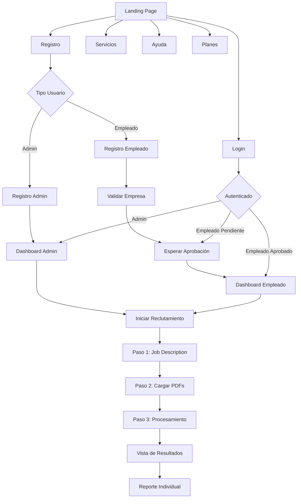

# Documento de Requerimientos del Producto - Aplicación de Análisis de CVs

## 1. Descripción General del Producto

Aplicación web para análisis automatizado de CVs de candidatos comparándolos con descripciones de trabajo específicas. Dirigida a empresas reclutadoras con sistema de roles (administrador/empleado) y gestión por niveles de suscripción.

La plataforma permite a las empresas optimizar su proceso de reclutamiento mediante análisis inteligente de currículums, con control de acceso por IP y sistema de autenticación robusto.

## 2. Características Principales

### 2.1 Roles de Usuario

| Rol | Método de Registro | Permisos Principales |
|-----|-------------------|---------------------|
| Administrador | Registro directo con datos de empresa | Gestionar empleados, configurar empresa, acceso completo a funciones |
| Empleado | Registro con ID de empresa + aprobación | Gestionar cuenta propia, usar funciones de análisis según plan |

### 2.2 Módulos de Funcionalidad

Nuestra aplicación de análisis de CVs consta de las siguientes páginas principales:

1. **Página de Inicio (Landing)**: sección hero, navegación principal, información de servicios, botón de inicio de reclutamiento
2. **Página de Autenticación**: formularios de login/registro, recuperación de contraseña, toggle administrador/empleado
3. **Página de Servicios**: descripción detallada de funcionalidades de análisis de CVs
4. **Página de Ayuda**: sección FAQ con dropdowns expandibles
5. **Página de Planes**: tres niveles de suscripción más plan de prueba
6. **Dashboard de Administrador**: gestión de empleados, configuración de cuenta, vista de plan actual
7. **Dashboard de Empleado**: configuración de cuenta personal, vista de plan y cuotas
8. **Página de Aprobación Pendiente**: vista de espera para empleados no aprobados
9. **Vista de Iniciar Reclutamiento - Paso 1**: descripción de trabajo con IA y preferencias
10. **Vista de Carga de PDFs - Paso 2**: área de carga de archivos PDF de candidatos
11. **Vista de Procesamiento - Paso 3**: procesamiento con fases y animaciones
12. **Vista de Resultados**: tabla de candidatos con análisis y acciones
13. **Vista de Reporte de Candidato**: detalles individuales con exportación

### 2.3 Detalles de Páginas

| Nombre de Página | Nombre del Módulo | Descripción de Funcionalidad |
|------------------|-------------------|------------------------------|
| Página de Inicio | Sección Hero | Mostrar valor propositivo, animaciones atractivas, navegación a otras secciones |
| Página de Inicio | Sección de Servicios | Enlaces directos a páginas de servicios, ayuda y planes |
| Página de Inicio | Botón CTA Principal | Redirigir a inicio de reclutamiento o login según estado de autenticación |
| Autenticación | Formulario de Login | Validar credenciales, gestionar tokens, redirigir según rol y estado |
| Autenticación | Formulario de Registro | Registro en dos pasos, validación en tiempo real de ID empresa, toggle admin/empleado |
| Autenticación | Recuperación de Contraseña | Envío de email de recuperación, validación de correo |
| Servicios | Descripción de Funcionalidades | Mostrar capacidades de análisis de CVs, comparación con job descriptions |
| Ayuda | FAQ Interactivo | Dropdowns expandibles con preguntas frecuentes, navegación intuitiva |
| Planes | Comparación de Suscripciones | Mostrar 3 planes + trial, características, precios, límites de CVs y usuarios |
| Dashboard Admin | Gestión de Empleados | Listar empleados, aprobar/rechazar solicitudes, eliminar con confirmación |
| Dashboard Admin | Configuración de Cuenta | Editar datos de empresa, cambiar contraseña, actualizar información |
| Dashboard Admin | Vista de Plan | Mostrar plan actual, CVs restantes, límites de usuarios |
| Dashboard Empleado | Configuración Personal | Cambiar contraseña, actualizar nombre y apellido |
| Dashboard Empleado | Vista de Cuotas | Mostrar CVs disponibles según plan de la empresa |
| Aprobación Pendiente | Estado de Espera | Mostrar mensaje de espera, información de contacto con administrador |
| Iniciar Reclutamiento - Paso 1 | Descripción de Trabajo | Textarea sin límites, botón "Mejorar con IA", llamada a API para optimización |
| Iniciar Reclutamiento - Paso 1 | Sección de Preferencias | Badges expandibles: Educación, Certificaciones, Títulos, Habilidades, Años de experiencia |
| Iniciar Reclutamiento - Paso 1 | Botón Continuar | Validar job description requerido, navegar al paso 2 |
| Carga de PDFs - Paso 2 | Área de Carga | Drag & drop para máximo 30 PDFs, validación de formato PDF únicamente |
| Carga de PDFs - Paso 2 | Botón Continuar | Validar archivos cargados, proceder al procesamiento |
| Procesamiento - Paso 3 | Fase 1 - Conversión | Convertir PDFs a base64 con loader y animaciones |
| Procesamiento - Paso 3 | Fase 2 - Análisis | Enviar datos al backend, mostrar progreso de análisis |
| Procesamiento - Paso 3 | Fase 3 - Resultados | Mostrar tabla de candidatos procesados |
| Vista de Resultados | Tabla de Candidatos | Columnas: Nombre, Carrera, % Compatibilidad, Acciones. Top 5 destacados |
| Vista de Resultados | Filas Expandibles | Click para mostrar explicación de compatibilidad |
| Vista de Resultados | Botón Exportar | Generar tabla de contactos con datos completos |
| Vista de Resultados | Acciones por Candidato | Dropdown: Descartar (mover al final), Generar Reporte |
| Reporte de Candidato | Vista Detallada | Información completa del candidato en nueva ventana |
| Reporte de Candidato | Exportación | Botones imprimir y descargar como PDF |

## 3. Proceso Principal

### Flujo de Administrador
1. Registro como administrador → Completar datos de empresa → Acceso a dashboard admin
2. Gestionar empleados → Aprobar/rechazar solicitudes → Configurar límites
3. Usar funciones de análisis de CVs según plan contratado

### Flujo de Empleado
1. Registro como empleado → Validar ID de empresa → Esperar aprobación
2. Una vez aprobado → Acceso a dashboard empleado → Usar funciones según permisos

### Flujo de Usuario Anónimo
1. Visitar landing page → Explorar servicios/ayuda/planes → Decidir registro
2. Alternativamente: Acceso directo a login si ya tiene cuenta

### Flujo de Proceso de Reclutamiento (Usuarios Autenticados)
1. Iniciar reclutamiento → Paso 1: Crear job description con preferencias
2. Paso 2: Cargar PDFs de candidatos (máximo 30)
3. Paso 3: Procesamiento automático (conversión → análisis → resultados)
4. Revisar tabla de candidatos → Expandir detalles → Acciones (descartar/reportar)
5. Exportar lista de contactos o generar reportes individuales

## 4. Diseño de Interfaz de Usuario

### 4.1 Estilo de Diseño

- **Colores primarios**: Azul corporativo (#2563EB), Verde éxito (#10B981)
- **Colores secundarios**: Gris neutro (#6B7280), Blanco (#FFFFFF)
- **Estilo de botones**: Redondeados con sombras sutiles, efectos hover animados
- **Tipografía**: Inter o similar, tamaños 14px-16px para texto, 24px-32px para títulos
- **Estilo de layout**: Diseño de tarjetas, navegación superior fija, sidebar para dashboards
- **Iconografía**: Iconos outline style, consistentes con Heroicons o similar

### 4.2 Resumen de Diseño de Páginas

| Nombre de Página | Nombre del Módulo | Elementos de UI |
|------------------|-------------------|----------------|
| Landing Page | Hero Section | Gradiente de fondo, animaciones de entrada, tipografía bold, CTA prominente |
| Landing Page | Navegación | Barra superior fija, logo izquierda, menú centrado, botón login derecha |
| Autenticación | Formularios | Campos con validación en tiempo real, toggle animado, botones con estados de carga |
| Servicios | Tarjetas de Funcionalidades | Grid responsivo, iconos descriptivos, animaciones hover |
| Ayuda | FAQ Accordion | Dropdowns con animaciones suaves, iconos de expansión |
| Planes | Tarjetas de Precios | Diseño de 4 columnas, plan recomendado destacado, botones CTA diferenciados |
| Dashboards | Sidebar Navigation | Menú lateral colapsible, iconos de estado, indicadores de notificaciones |
| Dashboards | Tablas de Datos | Paginación, filtros, acciones por fila, estados de carga |

### 4.3 Responsividad

Diseño mobile-first con breakpoints estándar. Optimización táctil para dispositivos móviles, navegación adaptativa y componentes que se ajustan fluidamente a diferentes tamaños de pantalla.