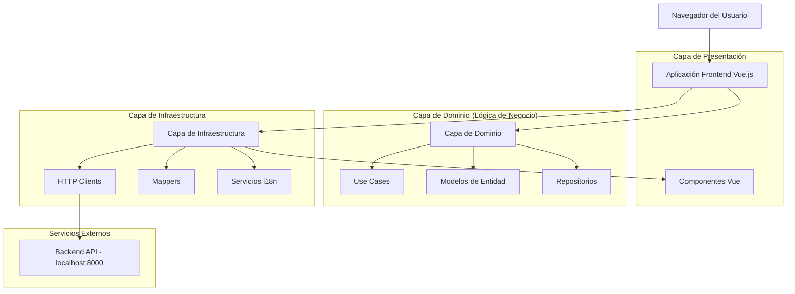
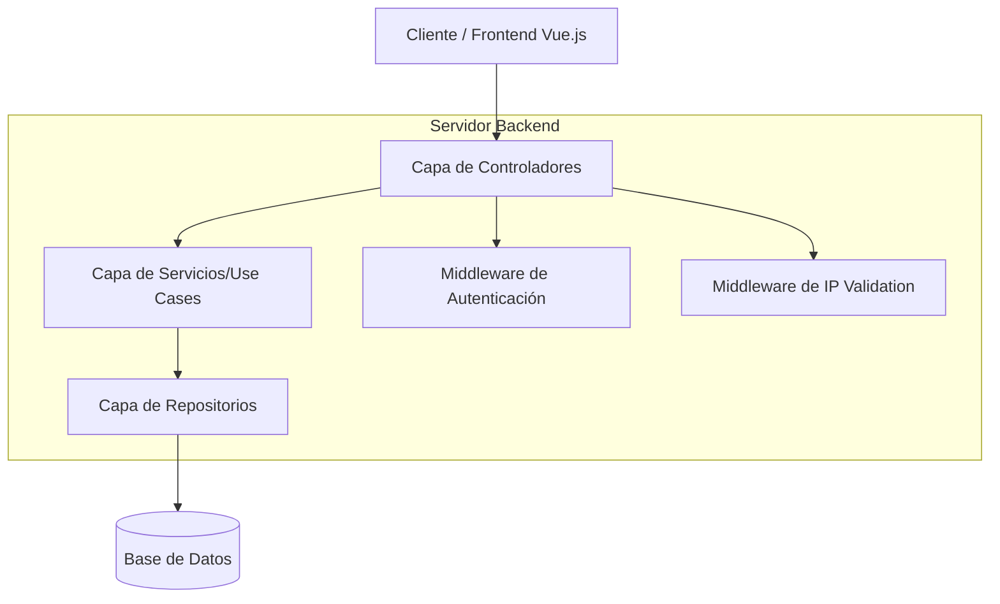
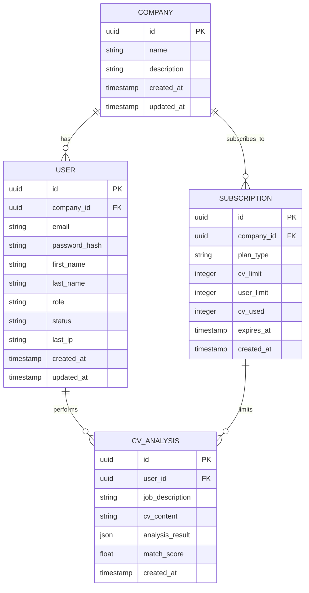

# Documento de Arquitectura Técnica - Aplicación de Análisis de CVs

## 1. Diseño de Arquitectura



## 2. Descripción de Tecnologías

* **Frontend**: Vue.js 3 + TypeScript + Vite + TailwindCSS

* **HTTP Client**: Axios para llamadas a API

* **Internacionalización**: Vue i18n (ya implementado)

* **Gestión de Estado**: Pinia stores

* **Routing**: Vue Router

* **Autenticación**: Cookies para tokens JWT

* **Backend**: API REST en localhost:8000 (variable de entorno)

## 3. Definiciones de Rutas

| Ruta                        | Propósito                                                    |
| --------------------------- | ------------------------------------------------------------ |
| /                           | Página de inicio (landing page) con información del producto |
| /login                      | Página de autenticación para usuarios existentes             |
| /register                   | Página de registro con toggle admin/empleado                 |
| /forgot-password            | Página de recuperación de contraseña                         |
| /services                   | Página descriptiva de servicios y funcionalidades            |
| /help                       | Página de ayuda con FAQ interactivo                          |
| /plans                      | Página de planes de suscripción y precios                    |
| /dashboard/admin            | Dashboard principal para administradores                     |
| /dashboard/admin/employees  | Gestión de empleados y solicitudes pendientes                |
| /dashboard/admin/account    | Configuración de cuenta y empresa                            |
| /dashboard/admin/plan       | Vista de plan actual y límites                               |
| /dashboard/employee         | Dashboard principal para empleados                           |
| /dashboard/employee/account | Configuración de cuenta personal                             |
| /dashboard/employee/plan    | Vista de cuotas y límites disponibles                        |
| /pending-approval           | Página de espera para empleados no aprobados                 |
| /recruitment/step1          | Paso 1: Job description con IA y preferencias                |
| /recruitment/step2          | Paso 2: Carga de archivos PDF de candidatos                  |
| /recruitment/step3          | Paso 3: Procesamiento y vista de resultados                  |
| /recruitment/results        | Vista de resultados con tabla de candidatos                  |
| /recruitment/report/:id     | Reporte individual de candidato (nueva ventana)              |

## 4. Definiciones de API

### 4.1 API Principal

**Autenticación de usuarios**

```
POST /api/auth/login
```

Request:

| Nombre del Parámetro | Tipo   | Requerido | Descripción              |
| -------------------- | ------ | --------- | ------------------------ |
| email                | string | true      | Email del usuario        |
| password             | string | true      | Contraseña del usuario   |
| ip\_address          | string | true      | IP local del dispositivo |

Response:

| Nombre del Parámetro | Tipo    | Descripción                   |
| -------------------- | ------- | ----------------------------- |
| success              | boolean | Estado de la respuesta        |
| token                | string  | JWT token de acceso           |
| refresh\_token       | string  | Token para renovación         |
| user                 | object  | Datos del usuario autenticado |

**Registro de usuarios**

```
POST /api/auth/register
```

Request:

| Nombre del Parámetro | Tipo   | Requerido | Descripción                           |
| -------------------- | ------ | --------- | ------------------------------------- |
| user\_type           | string | true      | "admin" o "employee"                  |
| first\_name          | string | true      | Nombre del usuario                    |
| last\_name           | string | true      | Apellido del usuario                  |
| email                | string | true      | Email del usuario                     |
| password             | string | true      | Contraseña del usuario                |
| company\_name        | string | false     | Nombre de empresa (solo admin)        |
| company\_id          | string | false     | ID de empresa (solo empleado)         |
| company\_description | string | false     | Descripción de empresa (paso 2 admin) |

**Validación de empresa**

```
GET /api/companies/{company_id}/validate
```

Response:

| Nombre del Parámetro | Tipo    | Descripción          |
| -------------------- | ------- | -------------------- |
| exists               | boolean | Si la empresa existe |
| company\_name        | string  | Nombre de la empresa |

**Renovación de token**

```
POST /api/auth/refresh
```

Request:

| Nombre del Parámetro | Tipo   | Requerido | Descripción              |
| -------------------- | ------ | --------- | ------------------------ |
| refresh\_token       | string | true      | Token de renovación      |
| ip\_address          | string | true      | IP local del dispositivo |

**Health Check**

```
GET /api/health
```

Response:

| Nombre del Parámetro | Tipo   | Descripción               |
| -------------------- | ------ | ------------------------- |
| status               | string | Estado del servidor       |
| timestamp            | string | Timestamp de la respuesta |

**Mejora de Job Description con IA**

```
POST /api/recruitment/improve-job-description
```

Request:

| Nombre del Parámetro | Tipo   | Requerido | Descripción                    |
| -------------------- | ------ | --------- | ------------------------------ |
| job_description      | string | true      | Descripción de trabajo original |
| ip_address           | string | true      | IP local del dispositivo       |

Response:

| Nombre del Parámetro | Tipo   | Descripción                   |
| -------------------- | ------ | ----------------------------- |
| improved_description | string | Descripción mejorada por IA   |
| suggestions          | array  | Lista de mejoras sugeridas    |

**Procesamiento de CVs**

```
POST /api/recruitment/analyze-candidates
```

Request:

| Nombre del Parámetro | Tipo   | Requerido | Descripción                           |
| -------------------- | ------ | --------- | ------------------------------------- |
| job_description      | string | true      | Descripción del trabajo               |
| preferences          | object | false     | Preferencias de educación, skills, etc |
| cv_files             | array  | true      | Array de archivos PDF en base64       |
| ip_address           | string | true      | IP local del dispositivo              |

Response:

| Nombre del Parámetro | Tipo  | Descripción                    |
| -------------------- | ----- | ------------------------------ |
| candidates           | array | Lista de candidatos analizados |
| processing_time      | int   | Tiempo de procesamiento en ms  |
| total_processed      | int   | Total de CVs procesados        |

**Estructura del objeto Candidato:**

```typescript
interface Candidate {
  id: string;
  full_name: string;
  email: string;
  phone: string;
  career: string;
  compatibility_percentage: number;
  compatibility_explanation: string;
  education: string[];
  certifications: string[];
  skills: string[];
  experience_years: number;
  references?: Reference[];
  cv_content: string;
  created_at: string;
}

interface Reference {
  name: string;
  position: string;
  company: string;
  phone?: string;
  email?: string;
}
```

Ejemplo de request de login:

```json
{
  "email": "admin@empresa.com",
  "password": "password123",
  "ip_address": "192.168.1.100"
}
```

## 5. Diagrama de Arquitectura del Servidor



## 6. Modelo de Datos

### 6.1 Definición del Modelo de Datos



### 6.2 Lenguaje de Definición de Datos

**Tabla de Empresas (companies)**

```sql
-- crear tabla
CREATE TABLE companies (
    id UUID PRIMARY KEY DEFAULT gen_random_uuid(),
    name VARCHAR(255) NOT NULL,
    description TEXT,
    created_at TIMESTAMP WITH TIME ZONE DEFAULT NOW(),
    updated_at TIMESTAMP WITH TIME ZONE DEFAULT NOW()
);

-- crear índices
CREATE INDEX idx_companies_name ON companies(name);
```

**Tabla de Usuarios (users)**

```sql
-- crear tabla
CREATE TABLE users (
    id UUID PRIMARY KEY DEFAULT gen_random_uuid(),
    company_id UUID REFERENCES companies(id),
    email VARCHAR(255) UNIQUE NOT NULL,
    password_hash VARCHAR(255) NOT NULL,
    first_name VARCHAR(100) NOT NULL,
    last_name VARCHAR(100) NOT NULL,
    role VARCHAR(20) DEFAULT 'employee' CHECK (role IN ('admin', 'employee')),
    status VARCHAR(20) DEFAULT 'pending' CHECK (status IN ('pending', 'approved', 'rejected')),
    last_ip VARCHAR(45),
    created_at TIMESTAMP WITH TIME ZONE DEFAULT NOW(),
    updated_at TIMESTAMP WITH TIME ZONE DEFAULT NOW()
);

-- crear índices
CREATE INDEX idx_users_email ON users(email);
CREATE INDEX idx_users_company_id ON users(company_id);
CREATE INDEX idx_users_status ON users(status);
```

**Tabla de Suscripciones (subscriptions)**

```sql
-- crear tabla
CREATE TABLE subscriptions (
    id UUID PRIMARY KEY DEFAULT gen_random_uuid(),
    company_id UUID REFERENCES companies(id),
    plan_type VARCHAR(20) NOT NULL CHECK (plan_type IN ('trial', 'basic', 'pro', 'enterprise')),
    cv_limit INTEGER NOT NULL,
    user_limit INTEGER NOT NULL,
    cv_used INTEGER DEFAULT 0,
    expires_at TIMESTAMP WITH TIME ZONE,
    created_at TIMESTAMP WITH TIME ZONE DEFAULT NOW()
);

-- crear índices
CREATE INDEX idx_subscriptions_company_id ON subscriptions(company_id);
CREATE INDEX idx_subscriptions_expires_at ON subscriptions(expires_at);
```

**Datos iniciales**

```sql
-- insertar planes de ejemplo
INSERT INTO companies (name, description) VALUES 
('Empresa Demo', 'Empresa de demostración para pruebas');

INSERT INTO subscriptions (company_id, plan_type, cv_limit, user_limit, expires_at)
SELECT id, 'trial', 15, 1, NOW() + INTERVAL '30 days'
FROM companies WHERE name = 'Empresa Demo';
```

